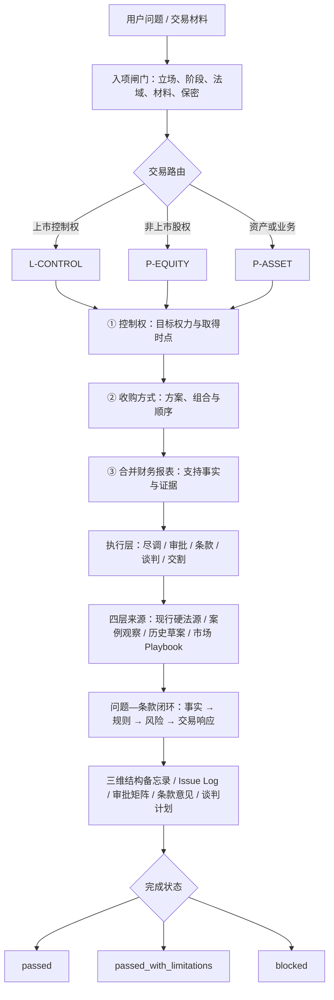

# 中国投资并购决策与执行 Skill

> 以“控制权—收购方式—合并财务报表”为三维决策内核，把交易目标转化为结构方案，并进一步落实为尽调、审批、条款、谈判、交割和失败预案。

`中国法域 v1` · `Buyer 默认` · `Seller 可切换` · `44 条版本化法源记录` · `26 项自动测试`

当前 Skill：[`handling-china-ma-transactions`](skills/handling-china-ma-transactions/SKILL.md)

这不是静态法规库、模板仓库或独立软件平台。它的产品任务是：先确定交易完成后需要取得什么权力，再比较用什么方式和顺序实现，最后验证该结构能否支持预期会计处理；其余能力都是三维决策的执行层。

## 产品内核：起点、重点、靶点

| 维度 | 核心问题 | 主要输出 |
|---|---|---|
| **控制权｜起点** | 交易后买方究竟能够决定什么，从何时开始决定 | 控制权矩阵、比例与权力口径、支持事实、反证和取得时点 |
| **收购方式｜重点** | 用哪种工具、组合和顺序实现目标，某一步失败后怎么办 | 至少三个结构方案或排除原因、成本/时间/审批/失败恢复比较 |
| **合并财务报表｜靶点** | 结构事实能否支持会计控制、并表目标及购买日判断 | 并表支持与证据矩阵、反证、购买日候选和审计师确认包 |

`L-CONTROL` 必须完整执行三维；`P-EQUITY` 和 `P-ASSET` 也要逐维给出状态，可以明确记录 `not-sought`、`not-applicable` 或 `pending-professional-confirmation`，不能静默跳过。

## 什么时候使用

当你的问题不是单纯“查一条法律”，而是需要把法律、事实和交易文件连起来时，可以调用本 Skill：

- **上市公司控制权收购**：协议转让、要约、向特定对象发行、董事会与表决权安排、过渡期和并表接口；
- **非上市公司股权收购**：老股转让、增资取得控制、分步交易、少数股权与控制安排；
- **资产或业务收购**：资产边界、合同与许可转移、人员承接、数据迁移、TSA和剥离安排；
- **法律尽职调查**：红旗尽调、完整尽调、Major Issues、更新尽调及问题—条款映射；
- **交易文件与谈判**：SPA/APA、股份转让或认购协议、披露、保证、赔偿、责任限制和交割机制；
- **审批与交割**：经营者集中、国资、外资准入、安全审查、ODI/外汇、数据、技术出口和出口管制；
- **中国买方收购境外目标**：完成中国侧工作流，并把目标所在地法律交给当地合资格律师确认。

纯少数股权融资且不以取得控制、业务或资产为目的时，应使用专门的 PE/VC 融资文件审阅能力。

## 能力地图

| 能力 | 典型问题 | 主要输出 |
|---|---|---|
| 交易结构 | 买什么、如何取得控制、两步交易怎样联动、失败后如何恢复 | 结构备忘录、方案比较、交易步骤与时间线 |
| 法律尽调 | 哪些事实会阻断交易、改变价格或形成交割后责任 | Issue Log、Major Issues、风险—条款矩阵 |
| 文件与条款 | 价格、CP、保证、披露、赔偿、责任限制是否闭环 | 审阅意见、条款建议、跨文件冲突清单 |
| 审批与交割 | 谁审批、何时办理、能否交割、需要什么关闭证据 | 分阶段审批矩阵、交割清单、长停日与Fallback |
| 买卖方谈判 | 开价是什么、让什么、换什么、何时升级或退出 | 谈判计划、Give → Get、让步顺序、Walk-away |
| 控制与并表接口 | 法律控制、治理控制、反垄断控制和会计控制是否一致 | 控制分析、反证清单、审计师确认材料包 |

## 三条交易路由

| Route | 适用交易 | 专属关注 |
|---|---|---|
| `L-CONTROL` | 中国境内上市公司控制权或潜在控制权收购 | 权益变动、30%要约线、一致行动、发行、治理改组、过渡期、披露与并表接口 |
| `P-EQUITY` | 非上市公司股权收购、控制型增资和分步收购 | 股权权属、优先权、价格机制、股东协议、控制移交与历史责任 |
| `P-ASSET` | 资产、业务和Carve-out收购 | 资产/负债边界、合同许可转移、员工与数据、TSA及交割后分离 |

只有真实的混合交易才叠加路由；不会因为某份文件同时出现“股份”和“资产”就机械加载全部模块。

## 工作架构



每个重大问题都要标明其影响控制权、收购方式或合并财务报表中的哪些维度，并最终落到一个或多个交易工具：价格、先决条件、交割交付物、保证与披露、赔偿与责任限制、过渡期承诺、终止权、托管/留置或交割后整改。

## 法源不是一个静态清单

| 来源层 | 可以支持什么 | 不能怎么用 |
|---|---|---|
| **现行硬法源** | 法律、行政法规、规章、司法解释及正式规则下的法律结论 | 不能因为已经入库就跳过本次交易的官方原文复核 |
| **监管与案例材料** | 特定监管关注、项目事实和程序观察 | 不能从单个问询或项目推导普遍法律规则 |
| **历史/草案材料** | 历史交易时点分析、修法趋势和结构弹性 | 不能覆盖当前有效规则或直接成为交割条件 |
| **市场 Playbook** | 结构选项、谈判策略、Fallback和文件联动 | 不能包装成法定要求或无来源的“中国市场比例” |

结构化法源库记录 `status`、`status_as_of`、生效/废止日期、条款定位、必要短摘、官方链接、版本关系和最后核验日。查询脚本可以按路由、主题、状态或日期缩小范围，但在签署、申报、公告、交割或出具高风险结论前，仍须在同一任务中打开官方原文。

对未公告上市公司交易，MNPI 是硬门：外部检索只使用抽象法律问题，不输入主体名称、价格、未公告结构或文件正文。

## 可复制的使用示例

<details open>
<summary><strong>1. A股29%协议转让、控制权与并表</strong></summary>

```text
使用 $handling-china-ma-transactions，从买方角度分析：我方拟协议受让一家A股上市公司29%股份，并取得过半数董事提名权，希望实现控制权变更和财务并表。请按控制权、收购方式、合并财务报表三维输出，至少比较三个结构方案或说明排除原因，再给出交割顺序、监管硬门、并表证据、失败恢复及Walk-away条件。法律核验截至今天。
```

</details>

<details>
<summary><strong>2. 非上市公司买方红旗尽调</strong></summary>

```text
使用 $handling-china-ma-transactions，按买方立场为一家境内非上市公司股权收购整理Major Issues。已知问题包括：核心许可证三个月后到期、历史社保欠缴、主要客户合同含控制权变更条款、部分客户数据可被境外系统访问。请逐项区分事实、缺失材料、现行法律、风险，并映射到价格、CP、保证、专项赔偿、承诺、终止或交割后行动；列明Owner、期限、关闭证据和状态。
```

</details>

<details>
<summary><strong>3. SPA重大条款审阅</strong></summary>

```text
使用 $handling-china-ma-transactions，从买方角度审阅我提供的SPA。请先确认文件版本和交易路由，再输出Major Issues、原条款问题、建议修改方向、谈判理由及跨文件联动。重点检查价格调整、先决条件、保证重申、披露、一般/专项赔偿、责任上限、长停日、终止、托管和交割交付物；不要用一般保证替代已知风险或法定审批。
```

</details>

<details>
<summary><strong>4. 切换卖方责任限制谈判</strong></summary>

```text
使用 $handling-china-ma-transactions，并明确切换为Seller立场。买方要求一般保证无限额、统一十年存续、数据室披露一律不得限定保证。请按一般保证、基本保证、税务、专项风险和欺诈分别设计cap、de minimis、basket、survival、knowledge qualifier和披露标准；给出开价、决策因素、Give → Get、让步顺序、Fallback及升级/走开点。没有可靠样本时不要声称市场百分比。
```

</details>

<details>
<summary><strong>5. 地方国企境外收购的中国侧审批</strong></summary>

```text
使用 $handling-china-ma-transactions，从买方角度分析地方国企收购境外非上市目标。请只对中国法给出确定性分析，按pre-signing、effectiveness、pre-closing、post-closing和continuing列出国资、评估、NDRC、MOFCOM、银行/外汇、经营者集中、数据、技术出口和出口管制事项；说明所需事实、责任人、完成证据和两周交割是否可行。外国目标所在地法律仅列触发因素、当地律师责任和交割交付物，不搜索或引用外国申报阈值。
```

</details>

## 输出示例

```text
事项：境内非上市公司股权收购
Route：P-EQUITY
Perspective：Buyer
As-of：2026-08-04
材料范围：许可证扫描件、管理层访谈；未取得续期申请及监管沟通
关键假设：许可证由目标公司持有且覆盖核心业务
法域：中国法
完成状态：passed_with_limitations
```

**DD-001｜核心许可证即将到期**

- **影响维度**：收购方式；若许可证决定相关活动和持续经营，同时影响控制权及合并财务报表判断；
- **已确认事实**：许可证将在三个月后到期；
- **待确认事实**：续期条件、申请进度、监管沟通及控制权变更是否触发同意；
- **风险事件**：无法续期可能导致核心业务中断，并改变交易价值基础；
- **主方案**：将取得有效续期许可及必要同意设为交割条件，并以新许可证和正式回执作为关闭证据；
- **Fallback**：延迟或分阶段交割、相关对价留置、专项赔偿及买方终止权；
- **Owner / Status**：目标公司合规负责人＋买方行业律师 / `Open`。

真实输出会继续给出当前官方依据、买卖双方立场、可否豁免、期限和失败后果；缺少材料时不会把结果写成无保留的 `passed`。

## 安装与调用

```bash
git clone https://github.com/zhy1126/Cross-border-M-and-A-Investment.git
cp -R Cross-border-M-and-A-Investment/skills/handling-china-ma-transactions ~/.codex/skills/
```

安装后，在任务中明确调用：

```text
使用 $handling-china-ma-transactions，从买方角度分析以下交易……
```

卖方任务请明确写明 `Seller` 或“卖方立场”。未写明立场时，Skill 默认买方。

## 验证

进入 `skills/handling-china-ma-transactions` 后运行：

```bash
python3 -m unittest discover -s scripts/tests -v
python3 scripts/validate_legal_authorities.py
python3 scripts/validate_skill_consistency.py
```

验证器检查法源结构、版本关系、官方域名、路由、模板和文件一致性；它不能替代具体交易的事实核验和专业判断。

## 使用边界

- 当前中国法硬法源库核验截至 `2026-08-04`；“已入库”不等于当前任务可以免除实时复核。
- v1不会搜索、引用、计算或确认外国申报阈值；外国法结论由当地合资格律师提供。
- 税务、估值、审计、环境、技术和行业专项问题会被识别并分配，但不会替代相应专业人士。
- 材料缺失、版本不清、扫描不可读或数据室未更新时，不会声称已经完成全面尽调。
- 本 Skill 是交易分析和工作流工具，不构成对具体事项的正式法律意见。

进一步阅读：[`SKILL.md`](skills/handling-china-ma-transactions/SKILL.md) · [三维交易决策内核](skills/handling-china-ma-transactions/references/three-axis-transaction-engine.md) · [三维结构模板](skills/handling-china-ma-transactions/assets/three-axis-structure-template.md) · [法源与时效协议](skills/handling-china-ma-transactions/references/legal-authority-protocol.md) · [结构化法源库](skills/handling-china-ma-transactions/references/legal-authorities.json)
